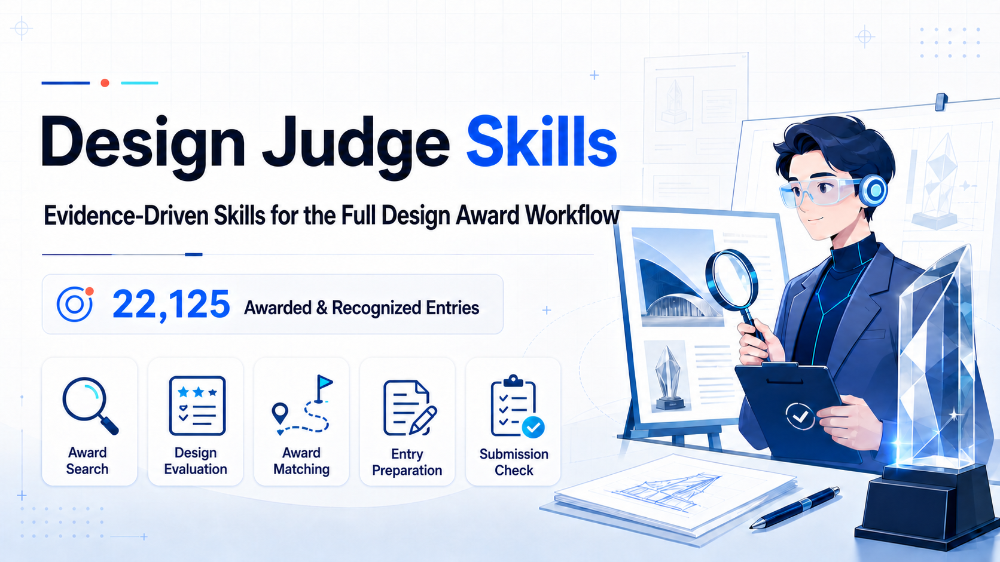
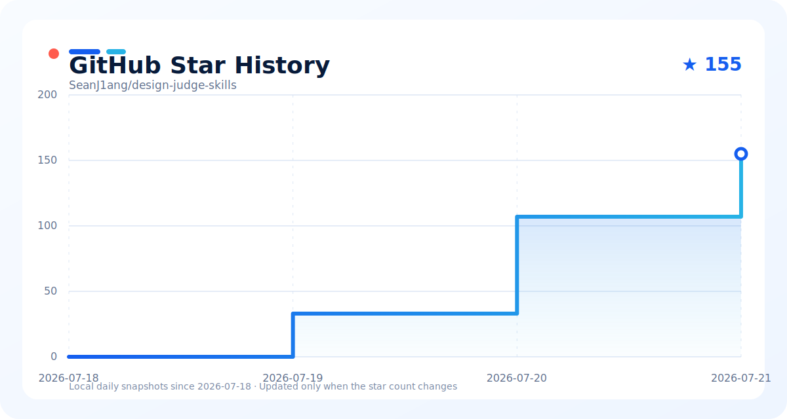

<div align="center">



# Design Judge Skills

Evidence-driven Agent Skills for the design-award workflow: winner research, design evaluation, award matching, entry writing, and final submission review.

[](LICENSE)
[](#5-installation)
[](#6-skill-index)
[](docs/benchmark-coverage_EN.md)
[](README.md)

[Quick Start](#4-quick-start) · [Benchmark Coverage](docs/benchmark-coverage_EN.md) · [Installation](#5-installation) · [Skill Index](#6-skill-index) · [Contributing](#7-contributing-and-development) · [Star History](#8-star-history) · [中文](README.md) · [日本語](README_JA.md)

</div>

`design-judge-skills` organizes the design-award journey into clearly bounded, independently triggerable, and testable skill modules. It builds traceable decision support around official sources, evidence anchors, and transparent scoring, using published criteria to compare submission routes, interpret fit, and set priorities.

## Contents

- [1. Project Overview](#1-project-overview)
- [2. Workflow](#2-workflow)
- [3. Design Principles and Boundaries](#3-design-principles-and-boundaries)
- [4. Quick Start](#4-quick-start)
- [5. Installation](#5-installation)
  - [5.1 Install with npx skills](#51-install-with-npx-skills)
  - [5.2 Claude Code](#52-claude-code)
  - [5.3 Codex](#53-codex)
  - [5.4 Other Agents](#54-other-agents)
- [6. Skill Index](#6-skill-index)
- [7. Contributing and Development](#7-contributing-and-development)
- [8. Star History](#8-star-history)

## 1. Project Overview

Design Judge Skills covers five core tasks in a design-award submission workflow:

- find and verify award-winning precedents in the same functional category;
- evaluate design quality and presentation with an evidence-based rubric;
- match a project to suitable awards, programs, tracks, and entry categories;
- turn user-provided project material into evidence-grounded entry text;
- audit a submission package against the current official rules.

The current configuration supports iF DESIGN AWARD, iF DESIGN STUDENT AWARD, Red Dot Product Design, Red Dot Design Concept, IDEA, DIA, K-Design, GOOD DESIGN AWARD Japan, Core77, James Dyson, and EPDA. Deadlines, fees, eligibility windows, categories, and submission specifications must be reverified on official pages at run time.

The evaluation module includes **22,125 aggregate observations** from iF, iF Student, Red Dot, and IDEA awarded or recognized works. They provide descriptive context only, do not alter the core score, and cannot estimate winning probability. See the [coverage, privacy, and limitations](docs/benchmark-coverage_EN.md).

## 2. Workflow

```text
Design materials ── uncertain route or complete journey ──> design-award-pipeline
  │
  ├─ Find comparable award winners ───────> design-award-search
  ├─ Evaluate design and presentation ────> design-evaluation
  └─ Select award / program / category ───> design-award-match
                                                │
                                                v
                                       design-information-prep
                                                │
                                                v
                                       design-submission-check
```

The modules can be used independently. A full submission workflow usually begins with evaluation or award matching, moves to information preparation once the target route is fixed, and ends with a submission-readiness audit.

## 3. Design Principles and Boundaries

1. **Prefer first-party sources.** Award rules and winner evidence come from official pages. Search snippets and third-party pages are discovery aids only.
2. **Separate facts from inference.** Facts from user materials, model inferences, and items awaiting user confirmation must remain distinct.
3. **Keep scoring transparent.** Evaluation and fit scores support decisions; they are not winning probabilities.
4. **Give each module one responsibility.** Retrieval, evaluation, award matching, entry writing, and submission review do not silently replace one another.
5. **Do not impersonate an official jury.** Skills may align with published criteria but must not invent hidden jury preferences or internal procedures.

## 4. Quick Start

After installation, give the Agent your design images, boards, manuals, project brief, research material, or submission files and state the task. The prompts below can be copied directly.

| Goal | Example prompt |
|---|---|
| Plan the complete journey | `Use $design-award-pipeline to plan the complete award route from these materials and maintain a handoff across stages.` |
| Find comparable winners | `Use $design-award-search to find officially verified award winners in the same category as this rehabilitation product.` |
| Evaluate a student concept | `Use $design-evaluation to evaluate the attached design. I define its maturity as Student Concept. Report design quality, presentation quality, evidence confidence, and Critical issues separately.` |
| Compare target awards | `Use $design-award-match to compare iF Student, Red Dot Design Concept, DIA, Core77, and James Dyson for this project.` |
| Prepare entry text | `Use $design-information-prep to prepare an IDEA entry from the attached material. List missing facts first, then draft each English field and check its word count.` |
| Run a final audit | `Use $design-submission-check to audit this package against the current official rules and return a go, conditional go, or no-go decision.` |

If you do not know which skill to use, invoke `design-award-pipeline`; it selects only the necessary modules rather than forcing a full pipeline.

## 5. Installation

Each `skills/<name>/` directory is an installable unit. `design-judge-shared` is a support package. It is included in a full installation; when installing `design-award-search` or `design-award-match` by itself, install the shared package as well.

### 5.1 Install with `npx skills`

[Node.js 18 or later](https://nodejs.org/) is required. The CLI does not need to be installed globally.

List the available skills:

```bash
npx skills add SeanJ1ang/design-judge-skills --list
```

Install every skill globally for Codex:

```bash
npx skills add SeanJ1ang/design-judge-skills --global --agent codex --skill '*' --yes --copy
```

Install one independent skill into the current project:

```bash
npx skills add SeanJ1ang/design-judge-skills --agent codex --skill design-evaluation --yes --copy
```

Install a skill that depends on the shared package:

```bash
npx skills add SeanJ1ang/design-judge-skills --global --agent codex \
  --skill design-award-search --skill design-judge-shared --yes --copy
```

Install the collection for every supported Agent:

```bash
npx skills add SeanJ1ang/design-judge-skills --all
```

Inspect and update installed skills:

```bash
npx skills list --global --agent codex
npx skills update --global --yes
```

### 5.2 Claude Code

Install the complete collection:

```bash
npx skills add SeanJ1ang/design-judge-skills --global --agent claude-code --skill '*' --yes --copy
```

Start a new Claude Code session after installation, then describe the task naturally or name the skill explicitly:

```text
Use $design-award-match to compare the best award routes for this student concept.
```

### 5.3 Codex

Install the collection in Codex's global skill directory:

```bash
npx skills add SeanJ1ang/design-judge-skills --global --agent codex --skill '*' --yes --copy
```

You can also give the repository directly to Codex:

```text
Install all Codex skills from https://github.com/SeanJ1ang/design-judge-skills.
Preserve every complete skill directory and install design-judge-shared as well.
Validate the frontmatter of every SKILL.md after installation.
```

Start a new Codex session after installation or update so the skill list is fully refreshed.

### 5.4 Other Agents

OpenClaw, OpenCode, Hermes Agent, Cursor, Cline, Gemini CLI, and other Agents supported by `npx skills` can be targeted with their `--agent` identifiers. For example:

```bash
npx skills add SeanJ1ang/design-judge-skills --global --skill '*' --yes --copy \
  --agent openclaw --agent opencode --agent hermes-agent
```

To install for every supported Agent:

```bash
npx skills add SeanJ1ang/design-judge-skills --all
```

For another Agent that supports `SKILL.md`:

1. Clone this repository to a stable path.
2. Copy or link each complete skill directory into the Agent's skill directory.
3. Preserve `SKILL.md`, `agents/`, `references/`, `scripts/`, `examples/`, and `tests/`.
4. Keep `design-judge-shared` with `design-award-search` and `design-award-match`.

## 6. Skill Index

| Skill | Status | Purpose | Typical triggers |
|---|---|---|---|
| [`design-award-pipeline`](skills/design-award-pipeline/README_EN.md) | Beta | Select the smallest sufficient route and maintain a handoff for uncertain or multi-stage requests | “complete award journey”, “what should I do next?”, “award pipeline” |
| [`design-award-search`](skills/design-award-search/README_EN.md) | Stable | Find and verify same-category award winners from official sources | “same-category winners”, “award winners”, “design benchmarks” |
| [`design-evaluation`](skills/design-evaluation/README_EN.md) | Beta | Evaluate design and presentation under a user-selected maturity track, with evidence confidence and Critical risks | “evaluate design”, “score”, “critique”, “batch evaluate” |
| [`design-award-match`](skills/design-award-match/README_EN.md) | Beta | Match awards, programs, tracks, and categories; check structural eligibility and submission priority | “which award should I enter?”, “award matching”, “award fit” |
| [`design-information-prep`](skills/design-information-prep/README_EN.md) | Beta | Extract project facts from user material and prepare the required entry fields | “prepare entry text”, “entry writing”, “project dossier” |
| [`design-submission-check`](skills/design-submission-check/README_EN.md) | Beta | Audit completeness, consistency, rights risks, and readiness under the current official rules | “pre-submission check”, “compliance review”, “go/no-go” |
| [`design-judge-shared`](skills/design-judge-shared/SKILL.md) | Support | Provide the shared taxonomy and official-source rules used by search and matching; not a standalone workflow | installation dependency |

`Beta` means the skill has example coverage and automated tests but may still have edge cases. `Stable` means its workflow and rules are relatively mature. `Support` marks a package used only by other skills. The badge counts the six user-facing workflows and excludes the shared support package.

## 7. Contributing and Development

### 7.1 Repository Structure

```text
skills/
├── design-judge-shared/
│   ├── SKILL.md
│   ├── category-taxonomy.md
│   └── source-registry.md
└── design-<topic>/
    ├── SKILL.md
    ├── README.md
    ├── README_EN.md
    ├── agents/openai.yaml
    ├── references/
    ├── scripts/
    ├── examples/
    └── tests/
```

### 7.2 Development Rules

- Keep the skill-directory name identical to the frontmatter `name`; use lowercase letters, digits, and hyphens only.
- Make `description` state what the skill does, when to trigger it, and when not to use it.
- Keep the core workflow in `SKILL.md`; move long rules, specifications, and schemas to `references/`.
- Put repeatable deterministic operations in `scripts/` and cover them with tests.
- Give every user-facing skill mirrored Chinese and English detail pages covering inputs, outputs, boundaries, and related skills.
- Do not hard-code current deadlines, fees, eligibility windows, or submission specifications as stable facts; verify them at run time from official sources.
- Do not commit API keys, cookies, login sessions, user project material, private winner databases, or copyrighted full case content.

### 7.3 Adding or Updating a Skill

1. Create or update a complete directory under `skills/design-<topic>/`.
2. Write valid `SKILL.md` frontmatter and a concise workflow.
3. Add the required UI metadata, references, scripts, examples, and tests.
4. Update both README skill indexes, status labels, and dependency notes.
5. Run the relevant unit tests and basic validation before committing.

Run every unit-test suite in PowerShell:

```powershell
Get-ChildItem skills -Directory | ForEach-Object {
  if (Test-Path (Join-Path $_.FullName 'tests')) {
    Push-Location $_.FullName
    python -B -m unittest discover -s tests -p 'test_*.py' -v
    Pop-Location
  }
}
```

Also run:

```bash
git diff --check
npx skills add . --list
```

Issues that report rule changes, failing cases, or compatibility problems are welcome. Pull requests should state the evidence source, validation method, and affected skills.

## 8. Star History

[](https://github.com/SeanJ1ang/design-judge-skills/stargazers)

GitHub Actions records the public star count daily and updates the local chart only when the count changes. History accumulates from the day local tracking is enabled, without relying on a third-party image service or the Stargazers user-list endpoint.
